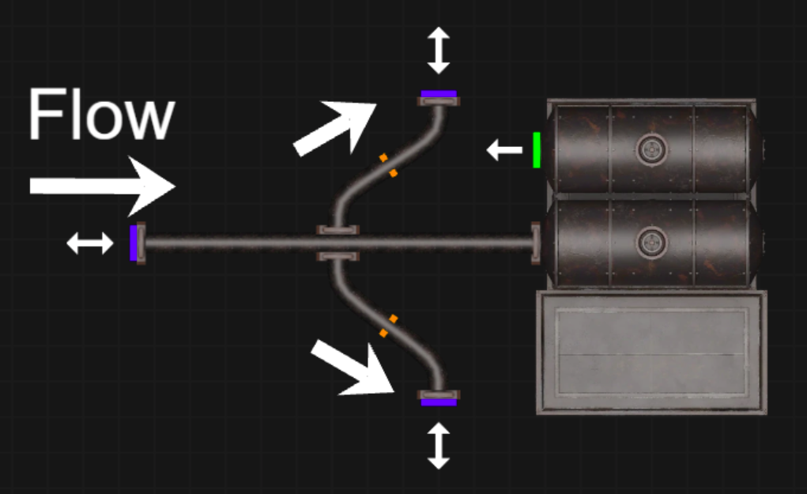

# Pipes
- Every two seconds (i.e. a two second tick), pipes "send out" their flow to all connected pipes
- the amount sent out is based on the sending and receiving pipe's storage levels
- the formula is 

$$f = \frac{c_s-c_r}{3}$$

where $c_s$ is the storage level of the sending pipe, $c_r$ is the storage level of the recieving pipe, and $f$ is the amount transmitted.

- The flow value is divided by three to accomodate a three-way split of output pipes
- there are some caveats to this formula based on what the pipe is connected to
    - if a pipe is sending liquid to a silo, it instead operates on a three second "tick"
    - if a pipe is connected to the input of a liquid transfer station (LTS), its flow is governed by the LST. Basically, the pipe operates on a one second tick and always empties the entirety of its contents.
    - if a pipe is connected to the output of an LTS, it operates on a one second tick and always recieves 1 "can" from the LTS, where a can is how many liters are in a can of that liquid (e.g. 50L for petrol, 33L for heavy oil)

- pipes have a 100L visible capacity but have a true capacity of 150L
    - This allows flow to happen based on the normal calculations even the pipe is nearly full, which accomodates for LTS and refinery flows
    - example: `LTS->pipe1` pipe1 has 99L, and the LTS is sending petrol. pipe1 can still recieve 50L from the LTS and now have 149L of petrol.

- pipes will not recieve flow if their storage level is over 100L
    - example: `LTS->pipe1` pipe1 has 149L, and the LTS is sending petrol. pipe1 will not recieve any more petrol still recieve 50L from the LTS and now have 149L of petrol.

# Silos
- silos have a capacity of 5000L, but for the sake of pipe calculations, they always have a storage level of 0L (i.e. $c_r=0$)
- silos operate on a three second tick
- silos send one third of their storage to the outlet pipe, but the flow is capped at 100L
    - silos have a maximum flow of 33L/s based on the above statement
- silos do not send flow to the input pipe. In this way, the input port can be treated as a pipe that always has a storage level of 0L.
- In some high-flow situtations where many LTS's are invovled, silos can actually decrease flow rates because of their 3 second tick.

# Liquid Transfer Station (LTS)
- liquid transfer stations have a capacity of 500 "cans", where the liters of a can depend on the type of liquid.

- Liquid transfer stations operate on a one second tick
    - on the inlet pipe, the LTS "absorbs" all of the liquid every second. If additional pipes are recieving liquid from the inlet pipe, its possible and common for the LTS to "absorb" the inlet pipe's liquid before it can be sent to the connecting pipes. Refer to this figure.

    - on the outlet pipe, one "can" is transferred per second.

# Oil wells (Liquid Producers)

- Oil wells behave the same as any type of building that produces fluid.
- Whenever a production slot finishes, its total produced liquid goes into the pipe. This is partial evidence for the pipes having a real capacity of 150L, which is the maximum amount of liquid produced by any facility.
    -   if too many of the queues finish within two seconds (i.e. the time it would take for the pipe to partially empty) and no more liquid can be transmitted to the outlet pipe, the extra is placed in the stockpile of the production buidling and has to be manually removed
    - if the stockpile of the building fills, production will stop.
    - after a server restarts, its common for each queue to finish nearly simultaneously. This can be disastrous for oil wells ans talked about in several [reddit posts](https://www.reddit.com/r/foxholegame/comments/1jtgqvk/pipe_system_issues_fluid_overflow_queues_week_23/). this post has different values for pipe capacities

- if a liquid producer needs liquid as an input, its input slot has the mechanics of a silo
# The Pipe Clock
- all liquid transfer happens at regular intervals (e.g. every two seconds)
- each liquid transferring object is placed in order along the timeline of the game clock at its given intervals so that two objects with the same tick always transfer their liquid in the same order.
- no two pipes/silos/lts ticks happen at the same time

- example `pipe1->pipe2->pipe3`: First, pipe3 sends its liqiud, then pipe1, then pipe2. lets say pipe3 ticks once at 0s, then agian at 2s. Pipe1 and pipe2 must tick some time between 0s and 2s

- mathematically, the order of pipe ticks has no affect on the steady state flow of a system but can affect the transient flow.

- after server restarts, it can look like all pipes are ticking at the same time, but there is actually millisecond differences that preserve pipe order.

# Validation

This basic theory can be tested on various expirements performed by others

## TearlochW83
[source](https://www.reddit.com/r/foxholegame/comments/1bsbugn/comment/kxhsy5g/?context=3)

these expiriments test liquid flows between LTS's under with and without silos. The difference in these expirements is measured through the number of pipe "joints", where two pipes make one pipe joint.

We recreate these test scenarios using foxhole planner and the analysis script, but we have to manually add the storage levels for the LTS's in the input file.